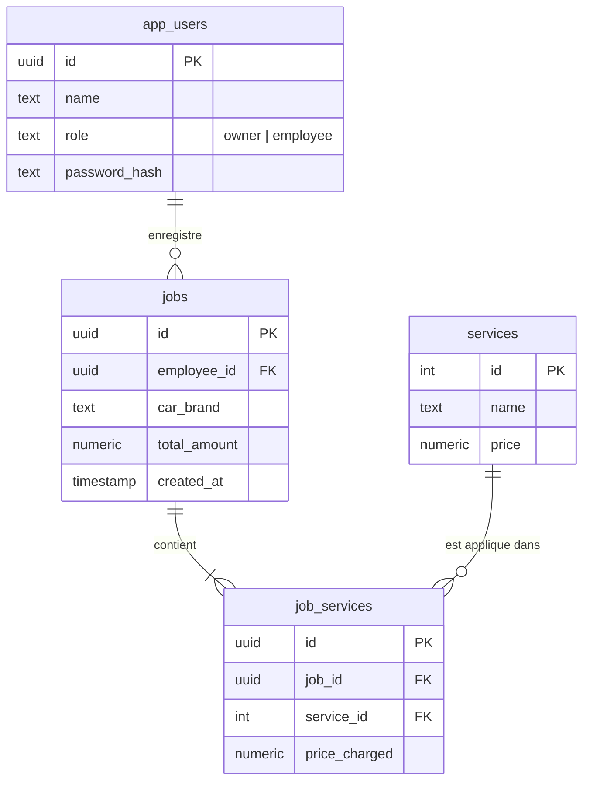

# Lavage Auto Express — Système de Gestion & POS

Ce projet est une application web moderne de type **Point de Vente (POS) et Portail de Gestion** destinée aux stations de lavage automobile (Lavage Auto Express) sur le marché tunisien. L'application est développée avec **Next.js (React)** et utilise **Supabase** comme base de données en temps réel pour l'authentification et le stockage des données.

---

## 🚀 Fonctionnalités Principales

L'application est divisée en deux interfaces distinctes basées sur le rôle de l'utilisateur :

### 1. Espace Employé (Terminal POS)
Le terminal de l'employé est conçu pour être rapide, tactile et intuitif. Il permet d'enregistrer les prestations fournies aux clients :
*   **Authentification simplifiée :** L'employé sélectionne son profil dans une liste déroulante et saisit son mot de passe.
*   **Sélection de la marque de voiture :** Une grille visuelle des marques de voitures les plus courantes sur le marché tunisien (Audi, BMW, Citroën, Dacia, Fiat, Ford, Hyundai, Peugeot, Renault, Toyota, Volkswagen, etc.) permet de renseigner rapidement le véhicule traité.
*   **Sélection dynamique des prestations :** Les services de lavage (ex: Lavage Intérieur/Extérieur, Lavage Moteur, Lustrage) sont récupérés en temps réel depuis la base de données.
*   **Calculateur de panier & Total en temps réel :** Le montant total est mis à jour instantanément en Dinars Tunisiens (DT).
*   **Validation des commandes :** Une fenêtre modale de confirmation récapitule les détails avant d'enregistrer la transaction de manière sécurisée en base de données.

### 2. Portail Gérant (Dashboard & Configuration)
L'espace gérant permet de suivre l'activité opérationnelle et de gérer la tarification :
*   **Tableau de bord en temps réel :**
    *   **Chiffre d'affaires journalier :** Somme en temps réel des ventes de la journée (en DT).
    *   **Compteur de véhicules :** Total des voitures lavées aujourd'hui.
*   **Historique des activités récentes :** Un tableau des 20 derniers lavages affichant l'heure, la date, la marque du véhicule, le détail des prestations effectuées, l'employé ayant réalisé le lavage, ainsi que le montant facturé.
*   **Gestion de la grille tarifaire :** Une interface dédiée à la mise à jour instantanée des tarifs de chaque prestation directement dans la base de données.

---

## 🛠️ Architecture Technique

*   **Frontend :** Next.js (App Router) avec React et TypeScript.
*   **Style CSS :** Tailwind CSS (intégré sous forme de classes utilitaires modernes).
*   **Base de Données / Backend :** Supabase (PostgreSQL).
*   **Gestion d'état locale :** `localStorage` pour persister la session de l'utilisateur actif (`current_user`).

---

## 📊 Modèle de Données (Base de données Supabase)

L'application repose sur quatre tables PostgreSQL interconnectées :

### Détail des Tables :
1.  **`app_users`** : Gère les profils des employés et des gérants.
2.  **`services`** : Répertorie les types de prestations disponibles avec leurs prix de base.
3.  **`jobs`** : Historise chaque lavage effectué (marque du véhicule, montant total, horodatage, ID de l'employé).
4.  **`job_services`** : Table de liaison qui conserve le détail des prestations choisies pour chaque travail enregistré, ainsi que le prix appliqué lors de la transaction.

---

## 🔒 Sécurité & Authentification

*   L'authentification s'appuie sur une fonction stockée nativement dans la base de données (**RPC Supabase**) nommée `verify_user_password`. Cette fonction compare le mot de passe hashé en base à l'aide de l'extension PostgreSQL `pgcrypto`.
*   **Mécanisme de secours (Fallback) :** En cas d'absence de la fonction RPC sur la base de données de test, l'application intègre une authentification locale simplifiée permettant de valider les comptes par défaut (`issam` / `employee`).
